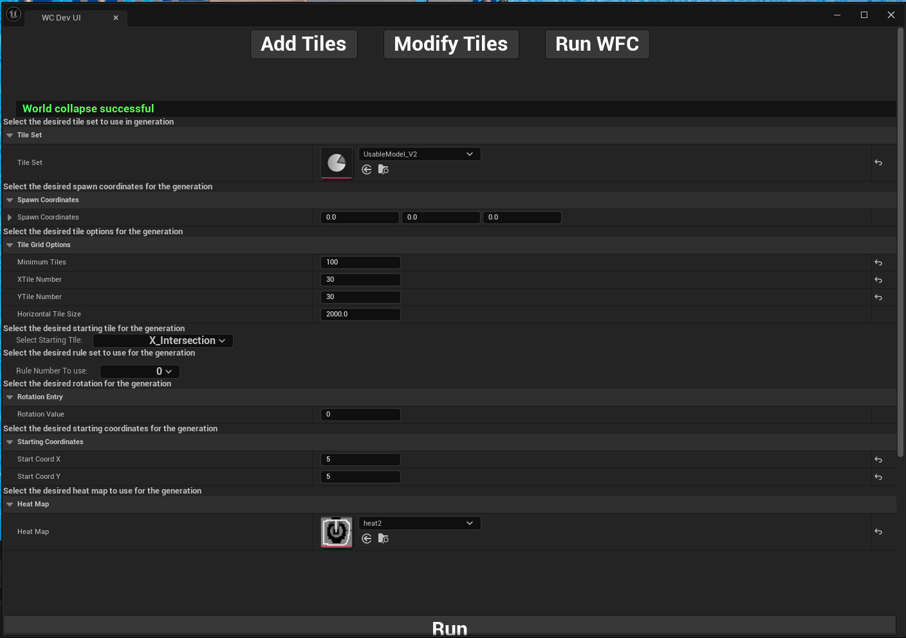

# <h2>World Collapse Plugin Public - Demo</h2>

This is a early version of a tool for making randomly generated levels in games
---
-  This project is not Ready for production and is purely meant as a proof of concept. It was built in a span of 7 weeks as a team of 3 people. 

World Collapse is based on wave function collapse. One of the main differences is that it gives more control over how many tiles it generates instead of it just filling out a grid. It also has the benefit of guaranteeing that the generated level is fully connected to the start. Currently it can generate massive mazes at fast rates without backtracking and fewer dead ends.
It uses a K of 1 to look ahead of its current position. 

This tool uses individual tiles that the user designed in 3D software and combines them in a procedural process that creates a level that is entirely connected to a defined starting point. It also avoids having tiles lead into a space that would result in a player falling out of the generation. 

**Installation**

*Requires that you have unreal engine 5.3 installed.*

1. Download
    - Find your Unreal Engine folder on your Drive and open the marketplace folder located in the Engine/marketplace directory (Eg: Epic\UE_5.3\Engine\Plugins\marketplace)
        - If this is your first plugin you installed it is possible that the "marketplace" folder does not exist yet. You can add it if needed.
    - Move the "WorldCollapse" file from the marketplace folder.
2. Add the plugin to the project
    - Open the project you want to use the plugin in.
    - Click on the Edit menu in the top toolbar.
    - select the plugin option and search for the plugin "WorldCollapse"
    - Click the checkbox and restart the engine.
3. Open the UI.
    - Open the level in which you want to use the plugin in.
    - open the "window" tab on the top toolbar and find the "WorldCollapse" option.

**Using the UI:**

1.	Adding tiles
	- You can start adding tile by selecting the WC model to add tiles to. If you want to create a blank WC model check the section above in point 13.
	- Once you have selected the model, the rest of the UI is enabled.
	- Add the desired actor (geometry model) that you want to add to the model.
	- Give the model a weight value of your choosing. (it is relitive to all other tiles you add so make sure a tile you want rarer is less than a tile you want to have more commonly). 
	- If you select the can rotate option, it will have the program add the tile in for all possible 90-degree rotations (also rotating the rules you enter next)
	- The Edit Rules section allows you to add rules in the form of strings to each edge of the tile.
		- The rules are relitive to the default placement of the tile when you drag the object into a scene. You can use the engines x, y, z system to add the correct rule to the edge you want to add it to. 
		- All edges that you want to let connect, need to have the same name.
		- If an edge is a wall, meaning there is no path in that direction, you check the wall checkbox below it. 
	- Once complete hit the “+” button at the bottom to add the tile. 
	- A message will appear to let you know if it was successfully added
3.	Modify Tiles
	- Works almost the same as add tiles
	- You can start by selecting the WC model to edit tiles in. 
	- Then from the “Geometry to edit” dropdown, select the tile you want to change.
	- From there the rest of the UI is populated with the settings of the tile.
	- Edit the settings like described in add tiles
	- Once you are done you can hit the save changes button to save the edit 
	- Clicking the delete button will remove the tile from the tile set
5.	Run WFC
	- To run the algorithm, start by selecting the tile set you want to use (WC_model)
	- Enter the World location in cm where the generation is meant to start.
	- The generation is generated into the positive x and y direction
	- Enter the minimum number of tiles you want to place. Make sure it is less then what you will let the max grid size to be. 
	- Enter the X and Y size of the grid, in number of tiles you want to place.
	- Give the UI the size each tile is meant to be in the generation. This changes the spacing of the tiles.
	- Select the starting tile which is the first tile that the generation will spawn.
	- Select the rule number the starting tile is meant to use (if there is more than one you have set)
	- Enter the rotation you want the starting tile to be placed in. This is either in number of 90 degrees you want to do (0-3) or in degrees as a multiple of 90 (0-270).
	- Enter the starting coordinates of the tile. This is where in the grid the tiles will be placed to start the generation. This needs to be an integer and most be a valid place to put the tile for the direction the tile is rotated in (eg. You cant place a intersection in the very corner because two paths would be facing the generation wall). 
	- You can add a heat map (2d-black and white image) to control the generation. Use white sparingly and use black to indicate were not to generate. 
	- The Image must be in a format of “B8G8R8A8” with a source format of “TSF BGRA8”
	- Once all is chosen click run to generate the a grid. 
	- If a grid already exists from running the UI and the UI has not been closed since then, it will use the same grid each time you click run.

General Info
-

- The demo tile set has a general average weight of 100 meaning a tile of weight 5 is rare and 200 is common.
    - if you would like to see how the system works I recommend loading it into the edit menu in the UI and looking through the tiles.
    - It has 3 rule types: 
        - "h" for hallways
        - "r" for roofed
        - "e" for empty (walled)
    - The tile AAStart has not yet been added to this tile set and can be used to test the system. (it is a tile with 4 hallways in each direction). You can add it and play around with its weight to see the effect.
- It is generally recommended to make generation around a 30 by 30 tile size to get the most consistant results.
    - it is possible to make much larger mazes but it will fail significantly more often at those sizes (work in progress)
- Heatmaps need to have the same configurations as the existing images in order to work.
- For this demo the starting tile needs to have at least 2 paths (can't be a dead end)
- Tiles used in this tool need to have their center at the origin to look correct.
- There are blueprintable functions and classes available for running the plugin at runtime.
    - I recommend primarily using the "WC_generation_grid" class and functions.
        - The important functions are "Initialize", "Collapse", and "resetGrid"
        - The other functions in this class are internal and exposed for testing.
- To create a new WC_model you can either copy the demo model and delete the content or you can create a new data asset object in the content browser and set WC_Model as its parent class.
- The UI is made so that when you run WC it will create a new "WC_generation_grid" object in the level. As long as the UI is not closed it will re-use that grid. However, after clossing and restarting the UI, it will create a new grid and the old one will stay if not removed manually. 
    - This was done to allow for multiple grids in the same level (will change in the future).

 Project contributors:
- 
- Robin Schniebel - Full stack developer / project lead
- John Harrell - Frontend developer
- Olsen Leist - Backend developer